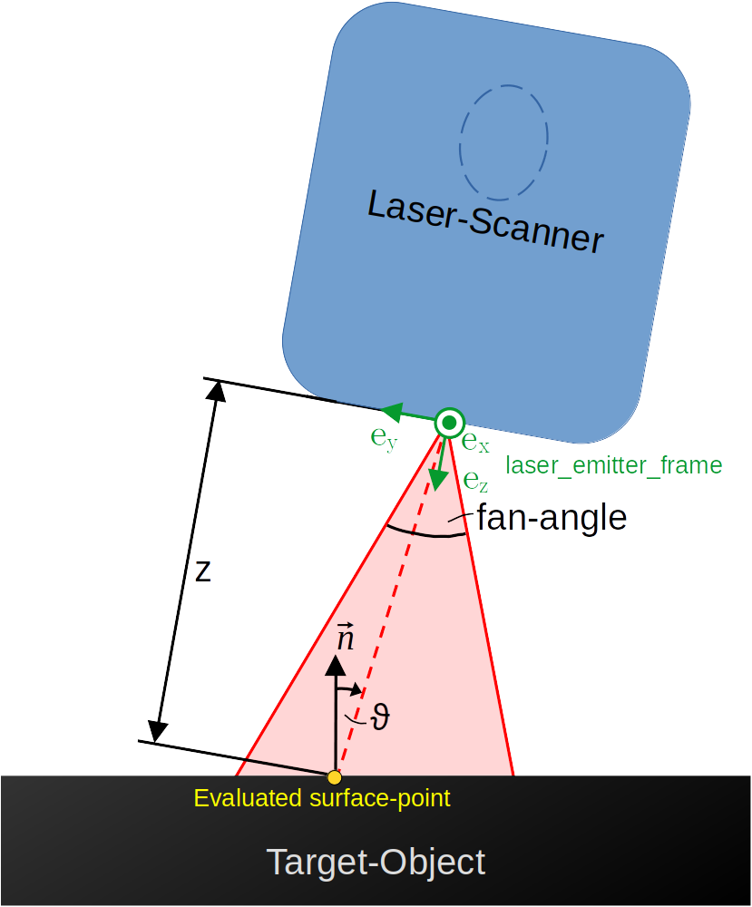
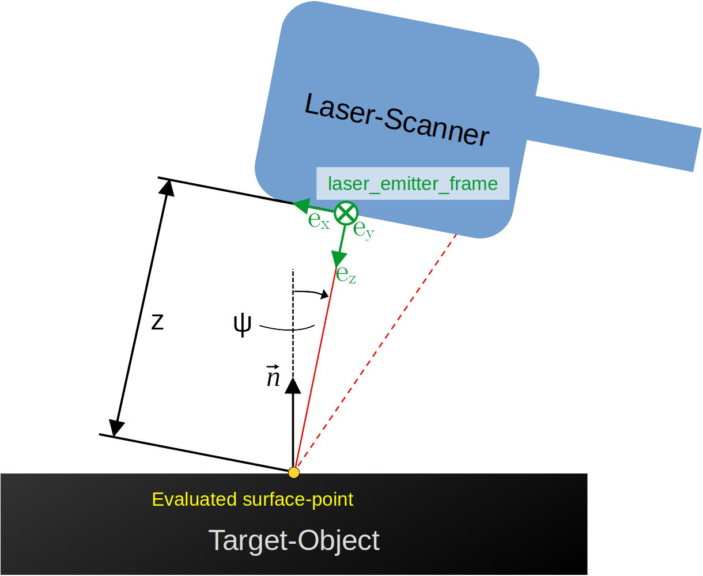

.. _sensor-model:

Sensor Model
============

Introduction and Basic Ideas
----------------------------

The Sensor Model is a utility-module to perform metrological evaluations on a given input.

The mathematical foundation of the model is derived in the corresponding
Bachelor's Thesis, however the theoretical understanding is not needed to work with this module. One task is to make qualified predictions about the uncertainty
of a given point within the scanners visibility, when certain spatial information (see below) is given. Within the :ref:`trajectory-manager`'s pipeline, this module
can also be used to determine which points can be measured and how 'uncertain' this measure for a :ref:`view`-object's trajectory given the occluding target-mesh, 
possible sampled surface points, ... ('context').

Commonly Used Geometric Terms
:::::::::::::::::::::::::::::

See the image below for additional context.

* laser_emitter_frame: See :ref:`view`
* gamma/:math:`\gamma`: Angle between the laser_emitter_frame's z-y-plane and the surface-normal of the sample + :math:`\frac{\pi}{2}` (for historic reasons)
* theta/:math:`\theta`:  Angle between the in normal-vector and the laser-emitter-ray-direction towards the sample, projected on the y-z-plane 
* z: Distance of the sample-point projected onto the z-axis of the laser_emitter_frame = Distance from the x-y-plane of the laser_emitter_frame
* :math:`\beta, u_{0}, \alpha, m_{L}`: Symbols of the uncertainty-formular (not important to use the sensor-model, detailed description in accompanying Bachelor's Thesis)

Visualization of Concepts
:::::::::::::::::::::::::

**Mind the orientation of the green laser_emitter_frame!**

Perpendicular To Laser-Fan
^^^^^^^^^^^^^^^^^^^^^^^^^^

Parallel To Laser-Fan
^^^^^^^^^^^^^^^^^^^^^

API-Specification
-----------------

.. automodule:: agiprobot_measurement.sensor_model
   :members:
   :show-inheritance: