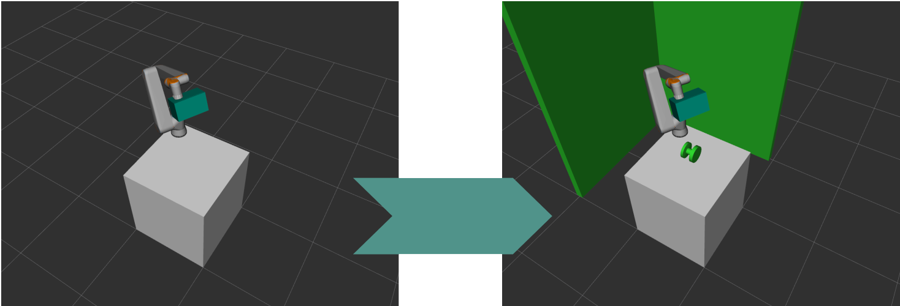
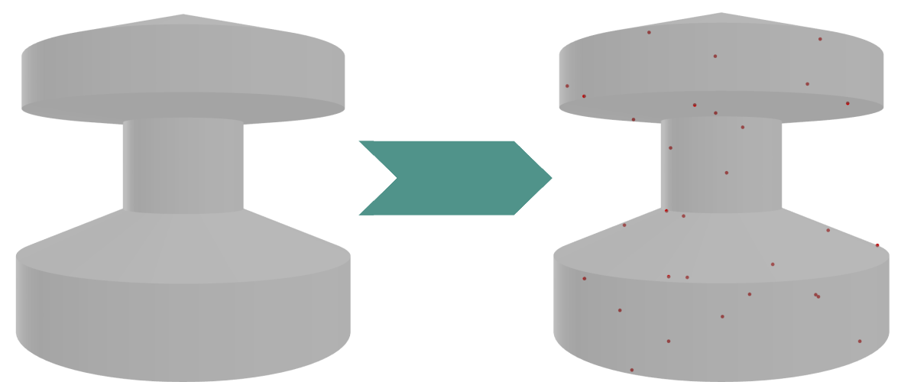
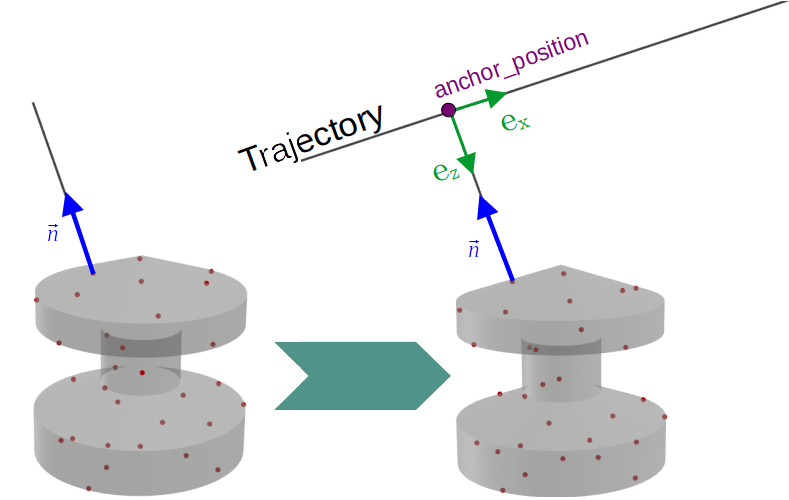
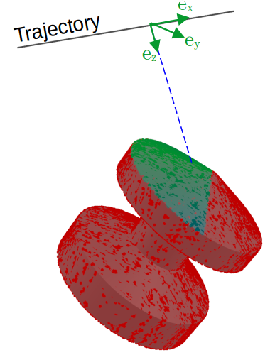
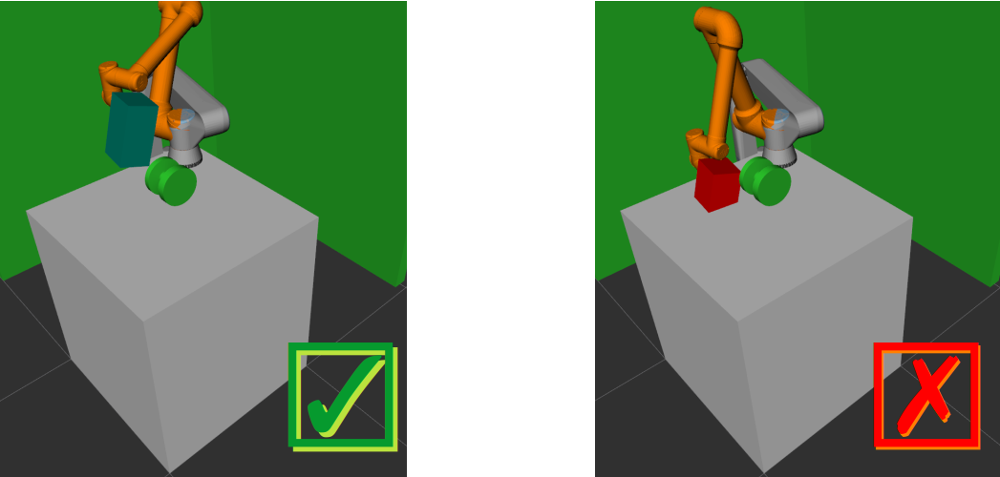

.. _view-planning-detailed:

View Planning Detailed
======================

0. Load the Task
----------------

Read in the given CAD-file of the target-object as well as its pose. The mesh is made available to the local trimesh-handler and loaded into the motion-planning-framework 
`MoveIt <https://moveit.ros.org>`_ so that it will be considered for collision-checks.

   

1. Sampling
-----------

Use trimesh to sample the mesh's surface into discrete surface-points depending on a specified sampling-density. The samples, corresponding face-normals and the target-mesh are
set as context in a :ref:`sensor-model`-instance.

2. View-Generation and -Evaluation
----------------------------------

For each-sample, generate :ref:`view`-objects by moving into the points face-normal and then applying rotations to get a variety of candidates per sampled surface point.
The resulting point is the anchor of the view. Each view is assigned a straight trajectory-line. 

After that, 2 main evaluations are executed:

Metrological Evaluation
:::::::::::::::::::::::

* Use the :ref:`sensor-model`-instance to analyze, which other sample-points are visible from this trajectory, and at what uncertainty
* Result = Visibilities and uncertainties (will be stored in the :ref:`view`-object)

   
  Higher sampling density than previously for vividness. Red points are immeasurable; Green points are measurable at low uncertainty, blue ones at high uncertainty.

Mechanical Evaluation
:::::::::::::::::::::

* Utilize `MoveIt <https://moveit.ros.org>`_ to examine, if this trajectory is actually executable in the scene (collision, reacability, ...).
* **Critical**: If the mechanical evaluation fails, the view will not be considered any further
  * Can also consider trajectory-parts: If e.g. 80% of the trajectory are be executable, this :ref:`view`-object might not be rejected
* Result = List of actual joint-values (will be stored in the :ref:`view`-object)

The sequence of these evaluations is implemented in a way to minimize compute-time.

3. View-Selection (Set Covering Problem)
----------------------------------------

When a set of valid :ref:`view`s has been found, not all :ref:`view`-elements must be executed for a valid result: A subset must be found that 
covers the same surface-points as all the found :ref:`view`s (= *Set Covering Problem*). This subset is in general much smaller than the original set and can be built using different algorithms:

As the first option, 'Greedy' implementation (both used in the papers) selects in each iteration that new :ref:`view` from the original set, that can contribute the most 
not-yet-visible surface-sample-points to the subset. If 2 or more :ref:`view`-objects can contribute the same amount, the one with the lowest uncertainty will be selected.

Another option is Integer Programming (IP):

Minimize :math:`\sum_{\forall i} c_i v_i` subject to :math:`\sum_{\forall i} m_{ij} v_i \ge 1~~~~\forall j` 

where :math:`v_i \in \{0,1\}` indicates if view i is element of the subset and :math:`m_{ij} \in \{0, 1\}`, if the sampled surface point j is measurable by the trajectory of view i.
:math:`c_{i}` is a cost-term. If it is constant, the IP-problems is identically to the Greedy approach. However, by assigning :math:`c_{i}` the time of the measurement-trajectory
of view i or its uncertainty, a bigger variety of solutions becomes possible than in the first option.

4. Connecting the Views
-----------------------

Lastly, the determined set of :ref:`view`-objects must be ordered for optimal execution. To do so, the current robot-pose is enqueued in an 'execution-list'.
Paths from the endpoint of the last element of execution-list are calculated to every non-enqueued view's trajectory-start- and -endpoint. The :ref:`view` with the shortest path-time becomes enqueued.
Also, the inter-view path will be stored in that :ref:`view` so that it will perform the exact same path during execution (if the path would get planned again dynamically,
it might be completely different due to the stochastic nature of path-planning). This step relies again on `MoveIt <https://moveit.ros.org>`_.

